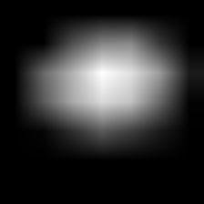
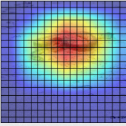
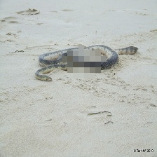
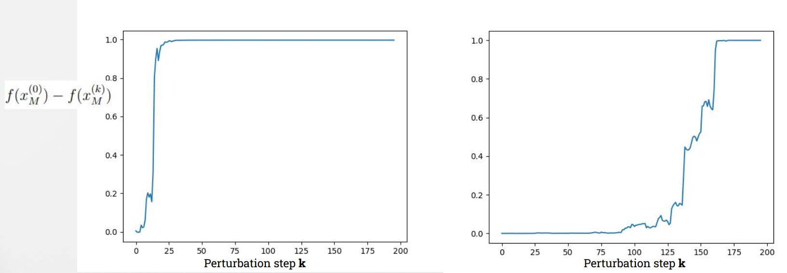

# Area Over Perturbation Curve using Most Relevan feature (AOPC)

## Introduction
Since we cannot trust the XAI methods blindly, it is necessary to define and have some **metrics capable of providing a quality index of each explanation method**. However, there are still no metrics used as standard in the state of the art. The objective assessment of the explanations quality is still an active field of research. The various metrics defined are not general but depend on the specific model task on which the XAI methods are used. <br>
Many efforts have been made to define **quality measures for heatmaps and saliency maps** which explain individual predictions of an Image Classification model. One of the main metrics used to evaluate explanations in the form of saliency maps is called **FaithFulness**. <br> 
The faithfulness of an explanation refers to whether the relevance scores reflect the true importance. The assumption of this evaluation metric is that perturbation of relevant (according to the heatmap) input variables should lead to a steeper decline of the prediction score than perturbation on the less important ones. Thus, the average decline of the prediction score after several rounds of perturbation (starting from the most relevant input variables) defines an objective measure of heatmap quality. If the explanation identifies the truly relevant input variables, then the decline should be large. <br>
There are several methods to compute the Faithfulness, one of them is a metric called **Area Over the Perturbation Curve - (AOPC)**, described below.

## Metric Description
The **AOPC** approach, measures the change in classifier output as pixels are sequentially perturbed (flipped in binary images, or set to a different value for RGB images) in order of their relevance as estimated by the explanation method. It can be seen as a greedy iterative procedure that consists of measuring how the class encoded in the image disappears when we progressively remove information from the image $x$. <br>
The classification output should decrease more rapidly for methods that provide more accurate estimates of pixel relevance. This approach can be done in two ways:
- **Most Relevant First (MoRF)**: The pixels are perturbed starting from the most important according to the heatmap (rapid decrease in classification output).
- **Least Relevant First (LeRF)**: The least relevant pixels are perturbed first. In this case, the classification output should change more slowly the more accurate the saliency method.

In this work, we decided to use the MoRF version. It is computed as follow:
```math
    \text{AOPC}_M = \frac{1}{L + 1} \Biggl \langle \sum_{k=1}^{L} f(x^{(0)}_M) - f(x^{(k)}_M) \biggr \rangle_{p(X)} 
```

where $M$ is the pixel deletion procedure (MoRF or LeRF), $L$ is the number of pixel deletion steps, $f(x)$ is the output value of the classifier for input image $x$ (i.e. the probability assigned to the highest-probability class),  $x^{(0)}_M$ is the input image after $0$ perturbation steps (i.e. $x^{(0)}_M = x$), $x^{(k)}_M$ is the input image after $k$ perturbation steps, and 
```math
\bigl \langle . \bigr \rangle_{p(X)}
```
denotes the mean over all images in the dataset.


---

### More information about the algorithm behavior
The algorithm starts with an image on which the AOPC (yes, there is an AOPC value for each image, and it is then averaged across all the images in the dataset) needs to be computed. This image is classified, and an explanation for this classification is generated using an explainability model. From this explanation, a grid is created (according to the dimensions requested by the user), and each grid block is assigned an importance value. The more important the pixels within the block are for the classification, the more important the block itself will be. This is done based on the values of the explanation. An illustrative example is provided in the images below.

<div style="text-align:center;">
<table>
  <tr>
    <td>
      
      <p align="center">Original image.</p>
    </td>
    <td>
      
      <p align="center">Explaination of the original image.</p>
    </td>
    <td>
      
      <p align="center">Example of how the grid is created. <br>The heatmap represent the importance. </p>
    </td>
  </tr>
</table>
</div>

Starting from this point, the various blocks are perturbed in descending order of importance, and the formula mentioned above is calculated. Perturbation can be done in various ways (such as zeroing out pixels, adding noise, using random values, etc.). In this case, we have chosen to use the **mean**. Specifically, for each block that needs to be perturbed, the average value is calculated, and this value is assigned to every pixel within the block. An illustrative example of how the perturbetion work over different iteration is provided in the images below.

<div style="text-align:center;">
<table>
  <tr>
    <td>
      
      <p align="center">Original image.</p>
    </td>
    <td>
      
      <p align="center">Image after 10 perturbation step</p>
    </td>
    <td>
      
      <p align="center">Image after 30 perturbation step</p>
    </td>
  </tr>
</table>
</div>

### How to analyze the results
As mentioned earlier, the faster the classification output decreases, the better the explainability method will be. Now observe the following example graphs:
- in the first case, we can observe a very high AOPC value, indicating a favorable evaluation for the explanation method.
- In the right image, we can see a lower AOPC value, indicating poorer performance.



## Usage
The project is composed by 3 different python script:
1. `AOPC_MoRF.py` $\rightarrow$ the main file in which the AOPC across al the image of your dataset is computed. It gives in output a `.pkl` file with the results. The results are saved in a dict that has the following format: <br>
{`image_id`: (`original_class`, `AOPC`, `sum(AOPC)/L+1`)}
2. `generate_cams.py` $\rightarrow$ the file that you have to use before the computation of AOPC in order to generate all the cams (explanations) using selected Explanation Method.
3. `report_analysis.py` $\rightarrow$ this is an optional file, you can use this to load the `.pkl` results file and plot the results (for example the AOPC chart).

Below are described the parameters and other characteristics of each script.

### `AOPC_Morf.py`
Command line arguments:
- `imgs_dir`: Path of the directory containing images for AOPC.
- `cams_dir`: Path of the directory containing explations for AOPC.
- `--block_size` (or `-size`): The block size for AOPC evaluation, with a *default* value of 8.
- `--block_row` (or `-row`): The number of blocks per row in images, with a *default* value of 28.
- `--percentile` (or `-pct`): The percentile up to which AOPC is computed, with a *default* value of `None`.
- `--results_file_name` (or `-file_name`): The name of the file in which results are saved, with a *default* value of `results.pkl`.
- `--verbose` (or `-v`): Enable verbose mode, with a *default* value of `False` (possible value `True` or `False`).

:warning: **Please note** that the `--block_size` and `--block_row` arguments must be consistent with each other. For example, using image of 224x224 pixel, if you use a block size of 8x8 pixel (the arguments is 8) you can compute by yourself the value for the argument block row $\rightarrow$ 224/8 = 28, so you will have a grid composed of 28x28 blocks, each of them composed by 8x8 pixels.

### `generate_cams.py`
For simplicity this file has no argument to pass by command line. You have only to change somethings inside the code. For example you can change the directory path from which the images are taken (the images which you want to classify and then to produce classifcation explainations). Inside you can also change the model for the classification and the Explaination method used. <br>
In the code we use a `Resnet50` model and `GradCam` as explaination method. <br>
Obviously you have to use this file only if you don't have already the explainations. If you know how to produce them by yourself you don't need this file (consider it just an utils file).

### `report_analysis.py`
Also this file has no argument to pass by command line. You only have to change the filename of the results `.pkl` file directly in the script. <br>
Also this file is an utils file, you can use this as a baseline to obtain more analysis on the computed results. As it is the file produce in output the mean AOPC across all the images in the dataset and plot the chart of the AOPC curve for each image. It saves each plot in the `AOPC_plots` :open_file_folder: directory.


### Example of Usage
1. The first step is to prepare the image dataset. For instance, place the images in a folder similar to the one already provided, named `imgs` :open_file_folder:.
2. Rename all the images following a specific pattern. For example, if you wish to use the provided **regex**, rename the images as `img_{X}.png`, where `X` is a number. We recommend starting from `0` and incrementing it iteratively by `1`, similar to the three example images already provided.
3. Next, you need to generate the explanations using the method you want to test. Inside the `generate_cams.py` file, you can find an example of how to do this using various methods taken from [this library](https://github.com/jacobgil/pytorch-grad-cam). To execute it, run the following command:
   ```bash
   python3 generate_cams.py
   ```
4. Similarly to the images, you should rename the generated cams correctly and place them in a folder, such as the one already provided, named `cams` :open_file_folder:. For example, you can name the cams as `img_cam_{X}.png`, where `X` is a number.
5. You now have everything you need to compute the AOPC across your image datasets. To do this, run the algorithm with the following command:
   ```bash
   python3 AOPC_MoRF.py imgs/ cams/ -block_size 8 -block_row 28 --file_name results.pkl -v True
   ```
6. The results will be saved in a file named `results.pkl`.
7. To analyze the results, you can use the script `results_analysis.py`:
   ```bash
   python3 results_analysis.py
   ```
   This script will generate charts similar to those found in the `AOPC_plots` folder :open_file_folder: and will provide the mean AOPC across all the images as output.

:exclamation:Now, you are ready to get started! :exclamation:

## Requiriments Installation
Before running the project, prepare the system as follows:
- Install virtuenv if is not in your system
```bash
pip install virtualenv
```
- Install the virtualenv in the same dir of the project
```bash
virtualenv AOPC
source AOPC/bin/activate
```
- Install all the requirements dependencies
```bash
pip install -r requirements.txt
```

### Questions and Issues :question:
If you have any problem and you need help, you can open an **Issue**.
### References
The code is implemented basing on the following research papers:
1. Samek, Wojciech et al. "[Evaluating the visualization of what a deep neural network has learned.](https://ojs.aaai.org/index.php/AAAI/article/view/6064)" IEEE transactions on neural networks and learning systems 28.11 (2016): 2660-2673.
\cite{tomsett2020sanity, samek2016evaluating}
2. Tomsett, Richard et al. "[Sanity checks for saliency metrics.](https://ojs.aaai.org/index.php/AAAI/article/view/6064)" Proceedings of the AAAI conference on artificial intelligence 34.04 (2020): 6021-6029.
